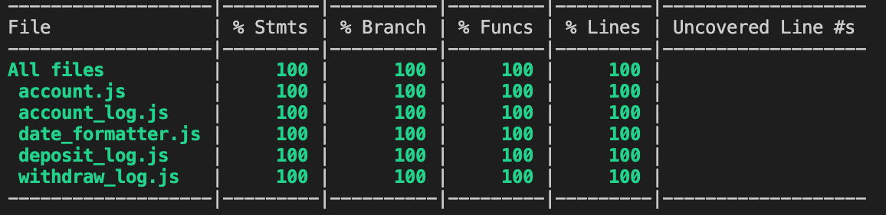

# Anthony's Bank Tech Test (JS)

## Introduction

Welcome to my attempt at the week 10 Makers Bank Tech test. I decided to tackle this problem using vanilla javascript, with jest as my testing library and eslint as my linter.

I started by breaking down the problem into some user stories, which covers each part of the requirements (please see below). I decided on five classes - 
* a basic account class, that tracks the balance and acts as a controller for the account_log class
* an account_log class, that deals with storing the logged data in the desired format.
* a deposit_log class, that is created by the account_log class and formats the deposits.
* a withdraw_log class, that is created by the account_log class and formats the withdrawals.
* a date_formatter class, that is created by the account_log class and exists only to get the current date and format it in the correct way.

## Setup
-----

* Clone the repository  
`git clone https://github.com/AJOsmaston/bank-tech-test.git`
* Install the dependencies  
`npm install`
* Open the REPL  
`node`
* Require the account file and save to a variable  
`const Account = require('./lib/account')`
* Instantiate the class  
`const bank = new Account`
* Deposit money using .deposit  
`bank.deposit(100)`
* Withdraw money using .withdraw  
`bank.withdraw(100)`
* Generate a report using .statement  
`bank.statement()`

## Requirements
-----

* You should be able to interact with your code via a REPL like IRB or the JavaScript console.  (You don't need to implement a command line interface that takes input from STDIN.)  
* Deposits, withdrawal.  
* Account statement (date, amount, balance) printing.  
* Data can be kept in memory (it doesn't need to be stored to a database or anything).  

## User Stories
-----
```
As a customer  
So that I can keep my money safe  
I want to be able to deposit my money  
```
```
As a customer  
so that I can spend my money   
I'd like to be able to withdraw my money  
```
```
As a customer  
so that I can keep track of my money  
I'd like to be able to check my balance  
```
```
As a bank owner
so that I can provide meaningful reports
I'd like the time of the deposit and withdrawal to be recorded
```
```
As a customer
so that I can monitor my budget
I'd like to be able to see a detailed account statement
```

## Evaluation
-----

On my initial approach, I planned for two classes - the account and account_log class, but ended up splitting down account_log as it had too many functions and was in violation of the SRP: Thus 5 classes were born. Potentially, I could have combined the deposit_log and withdraw_log classes into a transaction_log class with multiple if/elses to handle the differences, however, I think the way that I have attempted allows for more flexibility in future with the two seperate classes.

I did not include any sort of checks for validation of user input. I'm assuming that the input is standardised (i.e. you cannot  
`bank.deposit(a fish)`  
for example). This could be effectively implemented inside the account class, at the level of the deposit/withdraw functions, if needed. I have not included this in the attempt as it has not been directly asked for - these checks may be occuring on levels above this program. 

This said, however, you can deposit and withdraw decimal amounts, and it will calculate and store the correct amounts, whilst still only displaying the correct decimal places on the report (again this validation could be added at the deposit/withdraw level to stop decimals beyond in the hundredths if necessary).

Finally, the statement() function of account currently simply returns what is stored in the account_log class. I did this so that, if the data wanted to be manipulated (i.e console.logged or changed from being an array), this could be acheived here. It is currently output as an array, but this made the REPL formatting come as close as I could get it to the required output.

Overall, I really enjoyed this project. Attempting it in javascript was a challenge for me as it is my least comfortable language, but I think that I have fulfilled the criteria successfully and have successfully practised a lot of class extraction and refactoring.

## Misc
-----

* To run the tests  
`npm run test`  
<br>
<div>
  
</div>
<br>

* To check code coverage  
`npm run coverage`  
<br>
<div>
  
</div>
<br>

* To run the linter  
`npm run lint`

-----

<details> 
  <summary>View the given specification</summary> 
  
# Bank tech test

Today, you'll practice doing a tech test.

For most tech tests, you'll essentially have unlimited time.  This practice session is about producing the best code you can when there is a minimal time pressure.

You'll get to practice your OO design and TDD skills.

You'll work alone, and you'll also review your own code so you can practice reflecting on and improving your own work.

## Specification

### Requirements

* You should be able to interact with your code via a REPL like IRB or the JavaScript console.  (You don't need to implement a command line interface that takes input from STDIN.)
* Deposits, withdrawal.
* Account statement (date, amount, balance) printing.
* Data can be kept in memory (it doesn't need to be stored to a database or anything).

### Acceptance criteria

**Given** a client makes a deposit of 1000 on 10-01-2023  
**And** a deposit of 2000 on 13-01-2023  
**And** a withdrawal of 500 on 14-01-2023  
**When** she prints her bank statement  
**Then** she would see

```
date || credit || debit || balance
14/01/2023 || || 500.00 || 2500.00
13/01/2023 || 2000.00 || || 3000.00
10/01/2023 || 1000.00 || || 1000.00
```

## Self-assessment

Once you have completed the challenge and feel happy with your solution, here's a form to help you reflect on the quality of your code: https://docs.google.com/forms/d/1Q-NnqVObbGLDHxlvbUfeAC7yBCf3eCjTmz6GOqC9Aeo/edit
</details>
